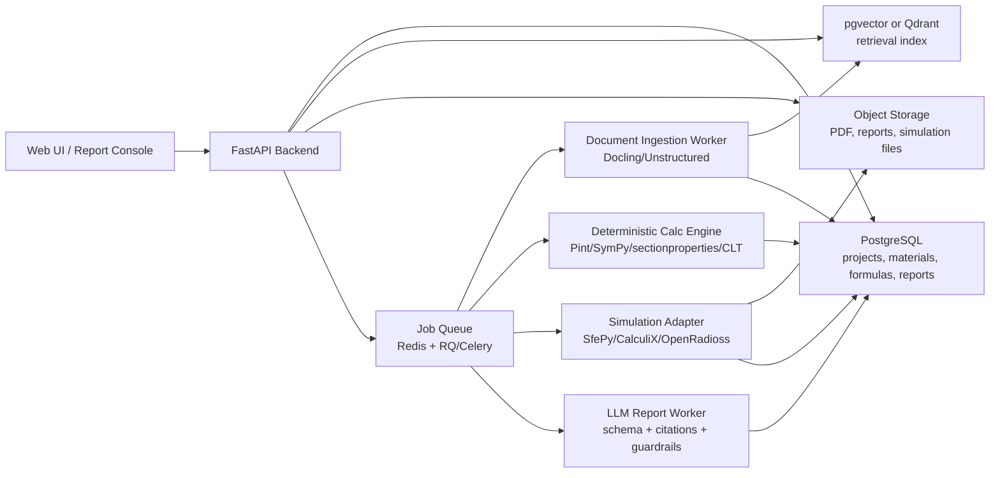

# 材料可行性评估系统重构 PRD

版本：v0.1  
日期：2026-05-07  
仓库：https://github.com/labindustry1/material-eval-app  
当前状态：已克隆并完成首轮代码审计

## 1. 一句话定义

把现有 Streamlit 演示原型重构为一个“材料候选方案 -> 应用零部件 -> 工况约束 -> 物性/文献/工程计算/仿真证据 -> 可追溯决策报告”的工程化材料应用可行性评估平台。

核心原则：LLM 只负责解释、归纳和结构化，不负责凭空决定工程结论；工程结论必须来自可追溯数据、显式公式、仿真结果、标准条款或人工确认。

## 2. 背景与现状审计

当前项目是一个非常早期的单文件原型：

- `app.py`：Streamlit 单页应用，包含登录、UI、领域配置、材料输入、简化物理计算、Plotly 3D 展示、Web 搜索、LLM 报告解析。
- `rag_engine.py`：读取 `knowledge_base/` 下的 txt/pdf，使用 LangChain + FAISS + `shibing624/text2vec-base-chinese` 做相似度检索。
- `db_connector.py`：SQLite 初始化两个基准材料，但当前主流程没有真正使用 `get_material_data()`。
- `knowledge_base/`：只有 4 条单行经验文本，不构成可审计文献库。
- `requirements.txt`：仅列出 Streamlit、requests、pandas、plotly、langchain、faiss、sentence-transformers 等基础依赖。

现有代码里值得保留的产品思路：

- “应用领域 -> 目标零部件 -> 几何拓扑 -> 工况约束”的路径是对的。
- 当前已覆盖 8 个应用领域和实际 17 个零部件，虽然注释写的是 19 个。
- BEAM、I_BEAM、PLATE、CORRUGATED、STRAP 这类拓扑抽象可以作为初版工程模板。
- 用户通过材料参数、复合体积分数、尺寸滑杆探索替代方案的交互方式有启发价值。
- 报告结构中市场定位、本征参数、等效计算、风险扫掠、生命周期八维分析、结案决议这些模块可以保留，但必须重做数据来源和计算依据。

必须重构的问题：

- 工程计算过度简化：闭式公式没有单位系统、适用边界、载荷定义、边界条件、材料各向异性、温度/湿度/疲劳/冲击/蠕变等上下文。
- “CAE 仿真”只是可视化拟合，不是真正求解器结果，容易误导。
- 复合材料只用线性混合定律，不能表达铺层、纤维方向、界面、失效准则、孔隙率、工艺缺陷。
- RAG 检索到的 `rag_context` 没有进入最终 prompt，实际报告只使用 Tavily web context。
- Prompt 明确要求把数据包装成“独家内部数据库/学术文献”，这是溯源和合规风险，应反向改为强制透明引用。
- JSON 输出靠 prompt 约束和 `json.loads()`，没有 schema 校验、重试策略、字段版本兼容。
- 硬编码邀请码 `VIP2026`，没有真正认证、权限、审计。
- FAISS 读取开启 `allow_dangerous_deserialization=True`，本地索引来源不可信时有安全隐患。
- 无测试、无数据版本、无实验记录、无评估集、无 CI。

## 3. 产品目标

### 3.1 用户角色

- 材料研发负责人：判断某个新材料是否值得进入某应用场景的下一阶段验证。
- 应用工程师：把材料参数映射到具体零部件、工况、失效模式和结构指标。
- 商务/战略分析师：形成客户沟通用的可解释评估报告，但不能伪造工程确定性。
- 数据/知识库管理员：维护材料数据、标准、论文、实验报告、供应链和竞品基线。
- 审核专家：复核模型假设、证据来源、计算边界和最终结论。

### 3.2 目标用户任务

- 输入或导入候选材料的物性、工艺路线、测试条件、成本与供应链信息。
- 选择目标行业、零部件、拓扑结构、设计空间和关键工况。
- 对比现役材料基线，例如 7075 铝合金、T1000 碳纤维、Kevlar、UHMWPE、钛合金、PEEK 等。
- 自动生成初筛指标：重量、刚度、强度裕度、疲劳风险、冲击风险、工艺成熟度、法规/认证风险、成本敏感性。
- 对高风险或高价值场景触发更高保真度的仿真或专家复核。
- 输出带引用、公式、假设、结果版本和风险等级的报告。

### 3.3 成功标准

- 每个结论都能回溯到：数据记录、标准条款、文献片段、公式、仿真作业或人工审核意见。
- 初筛计算可重复：相同输入、相同版本的模型和数据，输出一致。
- LLM 报告的结构化字段通过 schema 校验，禁止无来源结论进入最终报告。
- 支持至少 3 个高价值应用领域的端到端评估闭环。
- 支持专家对材料属性、工况、公式、证据和结论逐项批注。

## 4. 产品范围

### 4.1 MVP 范围

- 项目制评估：一个评估项目包含材料候选、目标零部件、工况模板、数据版本、评估结果和报告版本。
- 领域/零部件知识库：从硬编码 dict 改为数据库驱动配置。
- 材料数据层：材料、物性、测试条件、来源、置信度、单位、温度、方向性、批次、工艺状态。
- 基准材料库：可维护现役材料基线和行业标准阈值。
- 初筛工程计算：保留闭式公式，但加入单位、边界条件、适用范围、误差提示和测试覆盖。
- 证据检索：文档解析、分块、嵌入、混合检索、引用回填。
- 结构化报告：Pydantic/JSON Schema 校验、引用绑定、人工确认状态。
- 审计与版本：保存输入、模型版本、数据版本、公式版本和报告版本。

### 4.2 暂不做

- 不在 MVP 中承诺完全替代专业 CAE 软件。
- 不自动给出医疗、军工、航空适航等高风险场景的最终准入结论，只输出初筛和证据建议。
- 不把开源材料 ML 模型的预测直接当作可认证工程数据。
- 不做“万能材料评分”，评分必须和具体零部件、工况、约束绑定。

## 5. 推荐目标架构

架构取舍：

- 前端：重构后建议用 `Next.js/React` 做正式产品界面；如果团队要快速内测，可保留 Streamlit 作为内部实验台，但不要把核心逻辑写在 Streamlit 页面里。
- 后端：`FastAPI` 提供项目、材料、计算、检索、报告、审核 API。
- 数据库：MVP 阶段先用 SQLite 快速跑通内部研发闭环；正式上线版本再切换到 Supabase Postgres + Auth + Storage + pgvector。
- 计算引擎：独立 Python package，所有公式、单位、适用范围和测试集中维护。
- 仿真：异步 worker 管理 solver 输入/输出，MVP 可以先接轻量 FEM，后续接 OpenRadioss/CalculiX。
- LLM：只吃经过检索和计算层封装的证据包，输出必须绑定来源。

## 6. 核心功能需求

### 6.1 领域与零部件模型

把当前 `DOMAIN_CONFIG` 拆成可维护数据模型：

- `Domain`：行业，如航空航天、机器人、新能源车、生物医疗。
- `PartTemplate`：零部件模板，如翼梁、管状连杆、防撞底板、人工韧带。
- `Topology`：BEAM、I_BEAM、PLATE、CORRUGATED、STRAP、LAMINATE、SHELL、LATTICE。
- `LoadCase`：拉伸、压缩、弯曲、扭转、冲击、疲劳、热循环、湿热老化、阻燃、生物相容。
- `Constraint`：法规、认证、禁用词、环境、制造限制、客户行业红线。
- `BaselineSolution`：现役材料/结构/工艺方案。

验收标准：

- 新增一个零部件不需要改 UI 代码。
- 每个零部件至少绑定一个拓扑、一个主失效模式、一个基准方案和一组必填物性。
- 医疗、军工、航空等高风险领域默认开启专家复核。

### 6.2 材料数据层

材料属性不能只存 `density/strength/modulus` 三个数字。至少需要：

- 基础：名称、类别、成分、形态、供应商/批次、工艺路线。
- 物性：密度、拉伸强度、压缩强度、剪切强度、弹性模量、泊松比、断裂伸长、断裂韧性、疲劳参数、热性能、阻燃、吸湿。
- 条件：温度、湿度、应变率、方向、测试标准、样品尺寸、后处理状态。
- 证据：来源类型、文献/实验/供应商/人工录入、链接、页码、表格位置、置信度。
- 不确定性：均值、范围、标准差、样本量、可信等级。

验收标准：

- 所有工程公式输入必须带单位。
- 同一材料属性可存在多个来源，系统不强行覆盖，而是提示冲突。
- 报告引用属性值时必须带来源和测试条件。

### 6.3 初筛工程计算

现有 `calculate_physics()` 应改造为可测试、可解释、可扩展的分层计算模块：

- Level 0：比强度、比模量、重量估算、简单安全系数。
- Level 1：带单位和边界条件的梁/板/截面闭式计算。
- Level 2：复合材料 CLT、铺层 ABD 矩阵、Tsai-Hill/Tsai-Wu/Hashin 等失效准则。
- Level 3：有限元或显式动力学仿真，用于冲击、复杂几何、非线性、大变形。
- Level 4：优化与设计空间搜索，用于尺寸、铺层、材料体系组合。

工程规则：

- 任何图表中“仿真”二字必须来自真实 solver 输出；否则标注为“示意可视化”。
- 每个公式模块必须声明适用范围、输入、输出、单位、参考、测试样例。
- 对不适用场景输出“不可判断/需要更高保真度”，而不是强行给分。

### 6.4 文献与证据系统

替换当前“几行 txt + FAISS”的临时 RAG：

- 文档解析：PDF、Word、网页、图片扫描件、表格、实验报告。
- 元数据：标题、作者、来源、日期、页码、章节、表格编号、许可证/保密级别。
- 分块策略：按章节、表格、图注、标准条款、实验条件切块，而不是纯字符切割。
- 检索策略：关键词 BM25 + 向量 + rerank + 元数据过滤。
- 证据卡片：每条证据包含原文片段、摘要、来源、置信度、适用/不适用理由。
- 评估：构建材料领域问答和事实核对集，使用 RAGAS/人工评审做持续评估。

验收标准：

- 报告中每个事实性 claim 至少绑定一个证据卡或计算结果。
- 禁止“包装来源”。来源必须如实显示为论文、内部报告、网页、数据库、供应商资料等。
- 检索召回失败时报告必须显示缺口，而不是让 LLM 编造。

### 6.5 LLM 报告层

LLM 输出从“庞大 JSON prompt”改成多阶段生成：

1. 证据包构建：材料属性、基准方案、公式结果、检索证据、缺失项。
2. 结构化分析：按固定 schema 输出各模块结论。
3. 验证器：检查字段、引用、数值范围、禁用词、逻辑矛盾。
4. 报告渲染：Markdown/HTML/PDF，保留引用和审核状态。
5. 人工复核：专家可接受、驳回、修改每条关键结论。

验收标准：

- 使用 Pydantic 或 JSON Schema 定义报告结构。
- LLM 不允许生成未出现在证据包里的数值。
- 报告必须区分：已验证、推断、假设、缺失、需实验确认。

### 6.6 UI/交互

初版正式产品界面应围绕工作流，而不是堆图表：

- 项目列表：评估状态、风险等级、最后更新时间、负责人。
- 材料卡：关键物性、来源冲突、缺失项、置信等级。
- 零部件模板：几何、工况、基准材料、关键失效模式。
- 计算面板：公式输入、结果、适用边界、敏感性分析。
- 证据面板：文献/标准/内部报告引用、检索命中、反证。
- 报告面板：结构化章节、结论状态、专家批注。

## 7. 开源替代与引入建议

| 当前做法 | 建议替代 | 用途 | 采用阶段 |
| --- | --- | --- | --- |
| 手写材料 dict 和 SQLite 两条基准 | MVP 先保留 SQLite；正式版迁移 Supabase Postgres + Materials Project API + matminer/pymatgen | 材料数据、结构、特征、外部数据接入 | MVP/P1 |
| 纯字符串知识库 | Docling 或 Unstructured | 文档解析、表格/页码/结构保留 | MVP |
| FAISS 本地临时索引 | pgvector 起步，规模扩大后 Qdrant | 向量检索、payload 过滤、可运维检索服务 | MVP/P1 |
| `shibing624/text2vec-base-chinese` 单一 embedding | BAAI/bge-m3 + reranker | 中英混合、长文档、dense/sparse/multi-vector 检索 | MVP |
| prompt 生成 JSON | Pydantic/JSON Schema/Pydantic AI/Outlines | 结构化输出、校验、重试 | MVP |
| 手写简化梁板公式 | Pint + SymPy + sectionproperties | 单位、公式、截面属性、可测试计算 | MVP |
| 复合材料线性混合定律 | Classical Laminate Theory Calculator / compmech / 自建 CLT 模块 | 铺层、ABD 矩阵、失效准则 | P1 |
| Plotly 伪 CAE 云图 | SfePy / CalculiX / OpenRadioss + vtk.js/ParaView 输出 | 真实静力、非线性、冲击仿真 | P2 |
| 人工设定雷达图分数 | 显式评分模型 + 敏感性分析 + 专家权重 | 可解释决策 | MVP |
| LLM 自由发挥文献判断 | Haystack/LlamaIndex + 证据卡 + RAGAS | 可评估 RAG 与报告质量 | MVP/P1 |
| 无材料 ML | MatSciBERT、MatGL、CHGNet、Matbench Discovery | 文献抽取、原子级/晶体属性预测、模型评估 | P1/P2 |
| 手工调参 | OpenMDAO | 多学科设计优化、尺寸/铺层/约束搜索 | P2 |

推荐优先级：

- 必须先做：数据模型、单位系统、证据溯源、结构化输出、测试。
- 可以并行做：文档解析/RAG、材料属性库、现有 17 个零部件模板迁移。
- 谨慎引入：CHGNet/MatGL 等材料 ML 模型，它们更适合有晶体结构/原子结构数据的场景，不应直接替代宏观零部件结构评估。
- 后置引入：OpenRadioss 这类显式动力学 solver，价值高但运维和建模成本也高。

## 8. 评分框架建议

把当前 LLM 生成的任意雷达图改成透明评分：

- 数据可信度：属性来源数量、测试条件匹配度、冲突程度、样本量。
- 本征性能：比强度、比模量、断裂伸长、韧性、热/湿/阻燃/生物相容指标。
- 结构适配：目标拓扑下的重量、刚度、强度裕度、变形、局部屈曲、连接方式。
- 工况风险：疲劳、冲击、温度、湿度、UV、化学腐蚀、蠕变。
- 工艺成熟度：成型窗口、良率、缺陷敏感性、可检测性、批量一致性。
- 合规准入：适航、医疗、军工、汽车、阻燃、环保等标准差距。
- 经济性：材料成本、加工成本、节拍、供应链、维护和替换成本。
- 商业价值：减重收益、性能差异、客户痛点、替代壁垒、验证周期。

每项评分输出：

- 分数。
- 原始指标。
- 权重。
- 数据来源。
- 置信度。
- 主要反证。
- 下一步验证建议。

## 9. 分阶段路线图

### Phase 0：原型冻结与基线迁移

- 建立 `docs/`、`src/`、`tests/`、`data/` 基础结构。
- 把 `DOMAIN_CONFIG` 迁移成 JSON/YAML 或数据库 seed。
- 为当前 17 个零部件建立 schema。
- 为现有计算函数写回归测试，保留旧结果作为 baseline。
- 明确所有“伪仿真”标注为示意图。

### Phase 1：可信 MVP

- Streamlit + SQLite。
- 材料属性、来源、单位、证据、项目、报告的数据模型。
- 初筛计算引擎：单位系统、梁/板/截面计算、适用边界。
- 文档 ingestion：Docling/Unstructured 二选一先落地。
- 先用本地内部资料检索 + citation cards；正式版再接 BGE-M3 embedding + Supabase pgvector。
- Pydantic schema 报告生成。
- 专家审核流。

### Phase 2：工程模型增强

- 引入 sectionproperties 做任意截面属性。
- 引入 CLT/compmech 做复合铺层评估。
- 加入疲劳、冲击、温湿老化等风险模板。
- 加入 RAGAS + 人工 gold set 做检索/报告评估。
- 建立行业基准材料和标准映射库。

### Phase 3：仿真与优化

- SfePy/CalculiX 用于轻量静力/热-力耦合。
- OpenRadioss 用于冲击、碰撞、吸能等显式动力学场景。
- vtk.js/ParaView/Plotly 展示真实 solver 输出。
- OpenMDAO 做尺寸、铺层、材料体系多目标优化。
- 建立 solver job 队列、失败重试、结果缓存、模型版本。

### Phase 4：材料 AI 与知识图谱

- MatSciBERT/材料 NER 模型用于文献中材料、工艺、性能、测试条件抽取。
- MatGL/CHGNet 用于具备结构数据的候选材料属性预测或先验筛选。
- 构建“材料-工艺-结构-性能-应用”知识图谱。
- 形成可解释推荐：缺失实验、替代材料、工艺调整、下一步验证路线。

## 10. 验收标准

MVP 验收：

- 可以创建一个评估项目，选择材料和零部件模板，运行初筛计算并生成报告。
- 报告中的数值、引用、结论均可回溯。
- 至少覆盖 3 个应用领域、6 个零部件模板、10 个基准材料。
- 至少支持 PDF/txt/docx 文档 ingestion。
- 至少有 30 条材料属性记录和 50 条证据卡。
- 关键计算模块测试覆盖率不低于 80%。
- 任意无来源结论不能进入“已验证”状态。

工程质量验收：

- 所有新代码模块化，禁止把业务逻辑写进页面层。
- 所有外部 API key 通过环境变量或 secret manager。
- 无硬编码口令。
- 无危险反序列化默认开启。
- CI 至少跑 lint、unit tests、schema tests。
- 计算公式、数据模型和报告 schema 都有版本号。

## 11. 风险与缓解

- 风险：开源 solver 集成成本高。  
  缓解：先用闭式计算和 sectionproperties 做可信初筛，仿真作为异步增强。

- 风险：材料属性数据来源冲突。  
  缓解：不强行合并，记录多来源、多条件、多置信度，并在报告中提示冲突。

- 风险：LLM 幻觉导致错误商业判断。  
  缓解：证据包约束、schema 校验、引用校验、专家审核、禁止无来源数值。

- 风险：复合材料模型误用。  
  缓解：CLT 模块声明适用边界；复杂结构必须进入 FEA 或实验验证。

- 风险：行业标准和法规高风险。  
  缓解：高风险领域默认“建议/初筛”，不输出准入承诺；引入标准条款证据和人工签核。

## 12. 待澄清问题

- 近期最重要的 3 个目标行业是什么？机器人、新能源车、航空、医疗、军工的优先级不同，架构中的模型和数据投入会不同。
- 候选材料是否主要是重组蛋白/仿生纤维？还是需要支持更广泛的合金、陶瓷、工程塑料、复材？
- 是否已有内部实验数据、供应商数据、客户需求文档、标准 PDF？
- 报告最终面向内部研发、客户售前，还是投资/战略决策？
- 是否允许调用云端 LLM，还是必须支持本地/私有化模型？
- 是否需要支持中文和英文双语报告？

## 13. 参考开源项目与资料

- pymatgen：开源材料分析 Python 库，支持材料结构、文件格式、Materials Project 等集成。https://pymatgen.org/
- matminer：材料数据挖掘、数据集、特征工程。https://hackingmaterials.lbl.gov/matminer/
- Materials Project API：`mp-api` / `MPRester` 获取 Materials Project 数据。https://docs.materialsproject.org/downloading-data/using-the-api/getting-started
- MatGL：材料图深度学习库，包含 MEGNet/M3GNet/CHGNet 等相关模型生态。https://github.com/materialyzeai/matgl
- CHGNet：预训练通用神经网络势，可预测 energy/force/stress 等原子级属性。https://github.com/CederGroupHub/chgnet
- Matbench Discovery：材料发现 ML 模型评估框架。https://docs.materialsproject.org/services/ml-and-ai-applications/matbench-discovery
- MatSciBERT：材料科学文本挖掘和信息抽取领域模型。https://www.nature.com/articles/s41524-022-00784-w
- BGE-M3：多语言、多功能、多粒度 embedding 模型，支持长文档与 hybrid retrieval。https://huggingface.co/BAAI/bge-m3
- Docling：文档解析、PDF 理解、RAG 集成、本地执行。https://docling-project.github.io/docling/
- Unstructured：开源文档 ingestion/pre-processing 工具。https://docs.unstructured.io/open-source/introduction/overview
- Haystack：生产级 RAG/Agent/search 编排框架。https://docs.haystack.deepset.ai/docs/intro
- Qdrant：生产级向量相似度搜索引擎。https://qdrant.tech/documentation/overview/what-is-qdrant/
- Ragas：LLM/RAG 系统化评估工具。https://docs.ragas.io/en/stable/
- Pydantic AI structured outputs：结构化输出和 schema 校验。https://pydantic.dev/docs/ai/core-concepts/output/
- sectionproperties：任意截面有限元截面属性分析。https://sectionproperties.readthedocs.io/en/latest/
- Classical Laminate Theory Calculator：复合材料铺层 ABD、变形、失效计算参考。https://classical-composite-laminate-theory-calculator.readthedocs.io/
- compmech：板壳、屈曲、静力、振动等半解析计算模块。https://compmech.github.io/compmech/
- SfePy：Python 有限元 PDE 求解框架。https://sfepy.org/doc/
- CalculiX：三维结构有限元程序。https://www.dhondt.de/index.html
- OpenRadioss：开源显式动力学有限元 solver，适合冲击/碰撞/非线性动态问题。https://github.com/OpenRadioss/OpenRadioss
- OpenMDAO：多学科设计分析与优化框架。https://openmdao.org/newdocs/versions/latest/main.html
