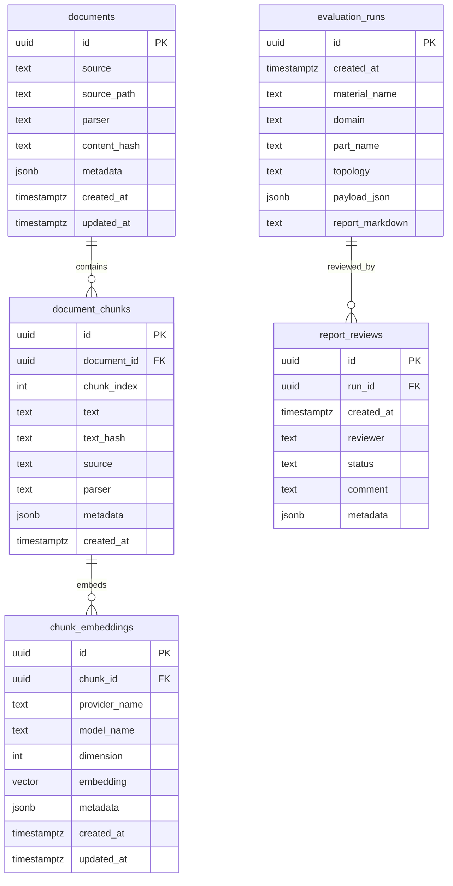

# Supabase 正式版 Schema 草案

日期：2026-05-07

目标：让当前 SQLite MVP 的评估记录、证据库、chunk 和 embedding 缓存可以平滑迁移到 Supabase Postgres + pgvector。

## 迁移文件

当前迁移文件：

```text
supabase/migrations/20260507145720_material_eval_core.sql
```

该 migration 使用私有 schema：

```text
material_eval
```

这样做是为了避免新表默认暴露到 Supabase Data API，并为后续内部后台/API 服务端访问保留更清晰的权限边界。

## 核心表



## 向量约定

- BGE-M3 dense embedding 使用 `extensions.vector(1024)`。
- cosine 检索使用 pgvector `<=>` 操作符。
- `chunk_embeddings_embedding_hnsw_idx` 使用 HNSW + `vector_cosine_ops`。
- RPC 函数 `material_eval.match_document_chunks(...)` 返回 chunk、来源和 similarity。

## 权限策略

- 所有表启用 RLS。
- 当前 migration 只授予 `service_role` 对私有 schema 的使用权限。
- 不给 `anon` 或 `authenticated` 授权。
- 正式 UI/API 需要开放给内部用户时，再基于项目、团队、角色设计 RLS policy。

## 与 SQLite MVP 的映射

| SQLite MVP | Supabase 正式版 |
| --- | --- |
| `evaluation_runs` | `material_eval.evaluation_runs` |
| `documents` | `material_eval.documents` |
| `document_chunks` | `material_eval.document_chunks` |
| `chunk_embeddings.vector_json` | `material_eval.chunk_embeddings.embedding vector(1024)` |
| `report_reviews` | `material_eval.report_reviews` |

SQLite 继续作为本地 MVP 运行时数据库；Supabase migration 先作为生产 schema 合约，由测试锁定，后续接 Supabase adapter 时直接复用。
