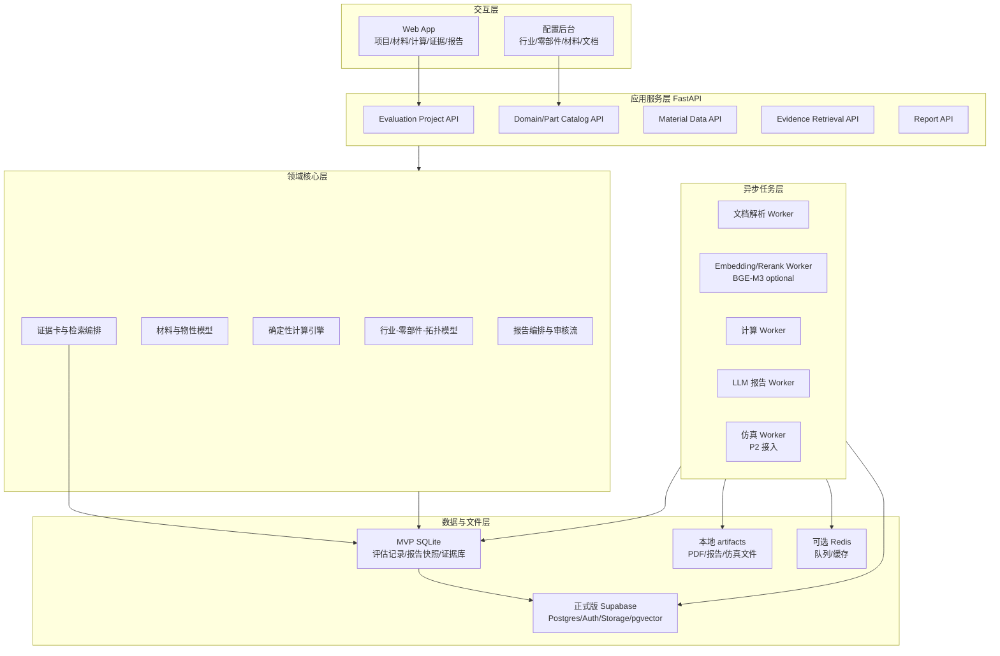
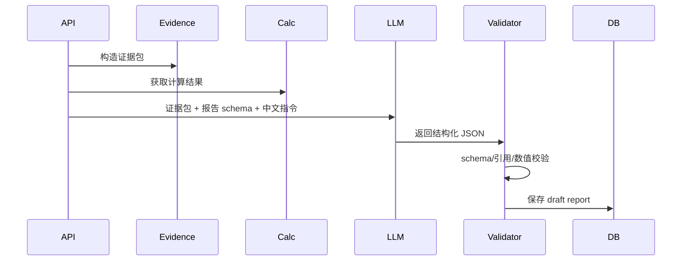

# 材料可行性评估系统目标架构 v1

日期：2026-05-07  
架构角色：从旧 Streamlit 原型重构为工程化内部研发评估平台  
报告语言：中文优先  
LLM 策略：允许调用云端 LLM，后续优先接 OpenAI ChatGPT/API 模型  
初始数据：沿用当前 GitHub 仓库已有候选材料、领域配置和 `knowledge_base/` 文档

## 1. 架构结论

新系统不应在旧 `app.py` 上继续堆功能，而应重建为“数据层、计算层、证据层、报告层、交互层”分离的工程系统。

旧项目可以保留三类资产：

- 行业与零部件路径：8 个行业、17 个零部件、BEAM/I_BEAM/PLATE/CORRUGATED/STRAP 拓扑。
- 初筛交互思路：材料参数 + 目标零件 + 几何尺寸 + 对标基准 + 报告。
- 内部资料入口：`knowledge_base/` 下的工艺、机器人、装甲等文本先作为种子文档。

旧项目必须废弃三类实现：

- 把所有业务逻辑写在 Streamlit 单页里。
- 把示意图包装成 CAE 仿真。
- 让 LLM 自由生成工程结论和来源。

新架构的核心规则：

- 计算结果来自确定性计算模块或真实 solver。
- 文献结论来自可追溯证据卡。
- LLM 只做结构化总结、解释、草拟报告，不直接创造事实。
- 报告面向内部研发，因此可以保留“不确定、待实验、证据不足”的判断。

## 2. 当前约束

用户已确认：

- 所有当前行业方向都要保留，未来都要投入使用。
- MVP 先挑 3 个相对简单的场景测试。
- 候选材料先使用旧项目中已有材料体系和默认参数。
- 内部数据、供应商需求文档先使用当前仓库已有文档。
- 最终报告面向内部研发。
- 允许调用云端 LLM，后续接 OpenAI ChatGPT/API 模型。
- 报告暂时只做中文。
- MVP 阶段先使用 SQLite，本地快速验证；正式上线版本再切换 Supabase。

MVP 推荐 3 个首测场景：

- 人形机器人核心骨架 / 下肢大扭矩管状连杆：BEAM，验证管状梁重量、弯曲、轴向承载。
- 智能穿戴与柔性外骨骼 / 智能穿戴承力外壳：PLATE，验证薄板重量、弯曲、冲击初筛。
- 智能穿戴与柔性外骨骼 / 柔性外骨骼助力带：STRAP，验证带状材料拉伸、伸长、疲劳风险。

不建议 MVP 先做航空、医疗、军工准入结论，因为这些场景法规与验证成本高。它们可以保留模板，但默认输出“内部研发初筛，不构成准入判断”。

## 3. 目标系统边界

### 3.1 系统要做什么

- 管理材料候选方案及其物性来源。
- 管理行业、零部件、拓扑、工况、基准材料。
- 从内部文档和后续上传资料中抽取证据。
- 根据拓扑和工况执行确定性工程初筛计算。
- 生成中文内部研发评估报告。
- 保存每次评估的输入、数据版本、计算版本、模型版本和人工复核意见。

### 3.2 系统不做什么

- 不替代专业认证、准入、医学/军工/航空最终判断。
- 不把 LLM 生成内容视为工程事实。
- 不在没有真实 solver 的情况下称为 CAE 仿真。
- 不在 MVP 中承诺复杂复合材料铺层、非线性冲击、真实碰撞仿真。

## 4. 总体架构



## 5. 分层设计

### 5.1 交互层

建议技术：

- MVP：可以继续用 Streamlit 做内部实验台，但必须只调用 API，不承载业务逻辑。
- 正式版：Next.js + React + Tailwind/shadcn 或等价组件库。

核心页面：

- 项目台账：查看所有评估项目、状态、风险、负责人、更新时间。
- 项目工作台：材料、零部件、工况、证据、计算、报告五个 tab。
- 材料详情：物性、来源、条件、冲突、缺失项。
- 证据详情：原文片段、来源、页码、相关结论、置信度。
- 报告详情：章节、引用、计算结果、人工审核状态。
- 配置后台：维护行业、零部件、拓扑、工况、基准材料。

### 5.2 应用服务层

建议使用 FastAPI：

- `POST /projects`：创建评估项目。
- `GET /catalog/domains`：读取行业和零部件模板。
- `POST /materials`：创建候选材料。
- `POST /documents:ingest`：导入内部资料。
- `POST /projects/{id}/runs`：启动一次评估。
- `GET /projects/{id}/runs/{run_id}`：查看计算与报告状态。
- `POST /reports/{id}/review`：提交专家复核意见。

服务层只做编排，不直接写复杂公式，不直接写 prompt。

### 5.3 领域核心层

建议拆成 5 个 bounded contexts：

- Catalog：行业、零部件、拓扑、工况、基准方案。
- Materials：候选材料、物性、测试条件、来源、置信度。
- Evidence：文档、chunk、检索、证据卡、引用关系。
- Computation：公式、单位、计算输入、计算结果、适用范围。
- Reporting：报告 schema、章节、结论、引用、审核状态。

这些模块要做成普通 Python package，可被 API、worker、测试直接调用。

### 5.4 异步任务层

需要 worker 的任务：

- 文档解析和分块。
- embedding 和 rerank。
- 运行计算和敏感性分析。
- 调用 OpenAI 生成结构化中文报告。
- 后续运行 SfePy/CalculiX/OpenRadioss 仿真。

MVP 可以用 Redis + RQ，后续任务复杂后升级 Celery 或 Temporal。

### 5.5 数据层

MVP 阶段使用 SQLite：

- 评估记录、报告快照、输入快照、documents、document_chunks、chunk_embeddings 先保存在 `data/mvp.sqlite3`。
- 种子配置继续放在 `data/seed/domain_config.json`。
- 内部资料继续读取 `knowledge_base/`，当前已接入 Docling/纯文本解析、SQLite 证据库、`rank-bm25` 默认证据召回和可选 BGE-M3 dense 语义检索。
- 文件、日志、临时产物放在 `data/artifacts/`。

正式上线阶段切换 Supabase：

- Supabase Postgres 管结构化数据，当前 migration 已在 `supabase/migrations/20260507145720_material_eval_core.sql` 建立 `material_eval` 私有 schema 草案。
- Supabase Auth 管内部研发账号。
- Supabase Storage 管内部文档、报告附件和后续仿真文件。
- pgvector 管正式版 RAG/证据语义检索。

迁移原则：

- 计算、材料、证据、报告模块不依赖具体数据库。
- `material_eval/storage.py` 先作为 SQLite adapter。
- 正式版新增 Supabase adapter，通过同一存储边界替换，不重写计算和报告逻辑。

## 6. 数据模型 v1

### 6.1 Catalog

```text
domains
- id
- name
- description
- risk_level
- active

part_templates
- id
- domain_id
- name
- topology_code
- description
- default_constraints
- search_keywords
- risk_level
- active

topologies
- code
- name
- required_dimensions
- supported_load_cases
- calc_modules

load_cases
- id
- code
- name
- description
- required_material_properties
- required_dimensions

baseline_solutions
- id
- part_template_id
- material_name
- process
- properties_snapshot
- evidence_ids
```

### 6.2 Materials

```text
materials
- id
- name
- category
- composition
- process_summary
- created_at

material_property_observations
- id
- material_id
- property_code
- value
- unit
- value_min
- value_max
- temperature
- humidity
- direction
- strain_rate
- test_standard
- source_id
- confidence

sources
- id
- source_type
- title
- file_id
- url
- page
- confidentiality
- created_at
```

### 6.3 Evidence

```text
documents
- id
- title
- file_path
- source_type
- language
- confidentiality
- checksum
- ingested_at

document_chunks
- id
- document_id
- chunk_text
- page_start
- page_end
- section_title
- chunk_type
- token_count

evidence_cards
- id
- chunk_id
- claim_summary
- raw_quote
- evidence_type
- applies_to
- confidence
- extracted_properties
```

### 6.4 Evaluation

```text
evaluation_projects
- id
- name
- material_id
- part_template_id
- status
- owner
- created_at

evaluation_runs
- id
- project_id
- input_snapshot
- data_version
- calc_version
- llm_model
- status
- created_at

calculation_results
- id
- run_id
- module_code
- inputs
- outputs
- assumptions
- applicability
- warnings

reports
- id
- run_id
- schema_version
- language
- status
- report_json
- markdown_path
- created_at

report_claims
- id
- report_id
- claim_text
- claim_type
- support_type
- evidence_ids
- calculation_result_ids
- review_status
```

## 7. 计算架构

### 7.1 计算模块分级

MVP 只做 Level 0 和 Level 1：

- Level 0：材料本征指标，比强度、比模量、密度收益。
- Level 1：梁/板/带的工程初筛计算，截面几何优先使用 `sectionproperties`，带单位和适用边界。

P1 做 Level 2：

- 复合材料铺层 CLT。当前 MVP 已提供 `material_eval/laminates.py` 的 A 矩阵和等效 Ex/Ey/Gxy 初筛，并已接入复合材料 UI 和报告。
- ABD 矩阵。
- Tsai-Hill/Tsai-Wu/Hashin 等失效准则。

P2 做 Level 3：

- SfePy 或 CalculiX 静力/热-力耦合。
- OpenRadioss 冲击、碰撞、吸能。

P3 做 Level 4：

- OpenMDAO 多目标优化。

### 7.2 计算模块接口

所有计算模块实现同一接口：

```python
class CalculationModule:
    code: str
    name: str
    version: str
    required_inputs: list[str]
    required_material_properties: list[str]
    applicability: str

    def validate(self, case: EvaluationCase) -> ValidationResult:
        ...

    def run(self, case: EvaluationCase) -> CalculationResult:
        ...
```

计算结果必须包含：

- 输入快照。
- 输出值和单位。
- 公式版本。
- 假设。
- 适用范围。
- warning。
- 是否可用于报告结论。

### 7.3 替代旧公式的策略

旧 `calculate_physics()` 不直接删除，先迁移为 `legacy_formula_v0`，并写测试锁定旧输出。然后逐个替换：

- `section_geometry_v1`
- `beam_bending_v1`
- `beam_axial_v1`
- `plate_bending_v1`
- `strap_tension_v1`
- `specific_strength_v1`
- `specific_modulus_v1`

这样能保留旧项目路径，又不会被旧实现绑住。

## 8. 证据与 RAG 架构

### 8.1 MVP 文档来源

先导入当前仓库：

- `knowledge_base/test.txt`
- `knowledge_base/人形机器人关节连杆减重白皮书.txt`
- `knowledge_base/军工装甲材料准入标准_2025.txt`
- `knowledge_base/工艺保密规范_V2.txt`

这些文档统一标记为“内部种子资料”，不是公开文献。

### 8.2 Pipeline


MVP 简化：

- txt 用本地 parser。
- md/html/pdf/docx/pptx 用 Docling。
- embedding 当前已通过 FlagEmbedding/BGE-M3 适配器可选接入，文档 chunk 向量缓存到 SQLite，默认不加载模型。
- 检索当前默认用 rank-bm25，可选 BGE-M3 dense cosine，正式版再切 Supabase pgvector cosine + 关键词过滤。

报告生成前，系统先构造 `EvidencePacket`：

```text
EvidencePacket
- material_facts
- part_requirements
- calculation_results
- retrieved_evidence_cards
- missing_information
- conflicts
- safety_notes
```

LLM 只能基于这个 packet 生成中文报告。

## 9. LLM 架构

### 9.1 OpenAI 集成方式

后续接 OpenAI 时，建议封装为 provider adapter：

```text
llm/
- providers/openai_provider.py
- schemas/report_schema.py
- prompts/internal_research_report_zh.md
- validators/report_validator.py
```

建议使用 OpenAI Responses API + Structured Outputs 或 function calling 的 `strict` schema 模式。OpenAI 官方文档说明 Structured Outputs 可让模型输出匹配指定 JSON Schema；如果连接工具/函数/数据，使用 function calling；如果只是约束最终回复结构，使用 structured response format。

官方参考：

- https://platform.openai.com/docs/guides/structured-outputs
- https://platform.openai.com/docs/api-reference/responses
- https://help.openai.com/en/articles/8555517-function-calling-in-the-openai-api

### 9.2 LLM 生成流程



### 9.3 LLM 禁区

LLM 禁止：

- 生成没有证据或计算支撑的数值。
- 把内部种子资料伪装成公开文献。
- 把示意可视化称为仿真。
- 输出“可量产、可认证、已满足标准”等最终承诺。

LLM 必须：

- 标明“已知事实、工程推断、待验证假设、缺失信息”。
- 每个关键结论挂证据卡或计算结果。
- 对数据不足的场景直接输出“不足以判断”。

## 10. 推荐目录结构

```text
material-eval-app/
  apps/
    web/                         # Next.js 正式前端，P1
    streamlit_lab/                # MVP 内部实验台，可选
  services/
    api/                         # FastAPI
      app/
        main.py
        routers/
        dependencies.py
  packages/
    material_eval/
      catalog/
      materials/
      evidence/
      computation/
      reporting/
      llm/
      common/
  workers/
    ingest_worker.py
    embedding_worker.py
    compute_worker.py
    report_worker.py
  data/
    seed/
      domains.yaml
      part_templates.yaml
      baseline_materials.yaml
    artifacts/
  docs/
    material-eval-refactor-prd.md
    target-architecture-v1.md
    adr/
  tests/
    unit/
    integration/
    fixtures/
  pyproject.toml
  docker-compose.yml
```

## 11. ADR：关键架构决策

### ADR-001：业务逻辑从 Streamlit 拆出

决策：Streamlit 只保留为内部实验 UI，核心逻辑迁移到 `packages/material_eval` 和 FastAPI。

理由：

- 页面层不可测试，旧项目已经证明单文件会失控。
- 计算、证据、报告都需要被 API、worker、测试复用。

代价：

- 初期开发量比直接改 `app.py` 大。

### ADR-002：MVP 使用 SQLite，正式版切换 Supabase

决策：MVP 继续使用 SQLite；正式上线版本再切换到 Supabase Postgres/Auth/Storage/pgvector。

理由：

- MVP 目标是快速跑通内部研发闭环，不先引入账号、RLS、云端存储和迁移复杂度。
- 当前文档和评估记录规模很小，SQLite 足够支撑首轮试用。
- Supabase 很适合作为正式版上线底座，但应在数据模型和权限模型稳定后接入。

迁移路径：

- 先保持 `material_eval/storage.py` 为 SQLite adapter。
- 后续新增 `material_eval/supabase_storage.py`，实现相同的保存/查询边界。
- 正式版启用 Supabase Auth、RLS、Storage、pgvector 后，再逐步迁移历史 SQLite 记录。

### ADR-003：LLM 只做报告，不做事实源

决策：LLM 输入必须是系统构造的 EvidencePacket，输出必须通过 schema 和引用校验。

理由：

- 面向内部研发，宁可保守，也不能产生虚假工程确定性。
- 旧项目 prompt 让模型包装来源，这是必须纠正的方向。

### ADR-004：MVP 先做确定性初筛，不做真 CAE

决策：MVP 的“工程计算”只承诺闭式初筛和敏感性分析。

理由：

- 真实仿真需要网格、边界条件、载荷、材料模型、solver 运维。
- 当前阶段更重要的是把数据、单位、证据和报告链路做可信。

迁移路径：

- P2 接入 SfePy/CalculiX/OpenRadioss worker。

### ADR-005：所有行业保留，但高风险行业默认初筛

决策：航空、医疗、军工等高风险行业保留模板，但报告状态默认是“内部研发初筛”。

理由：

- 用户明确所有行业未来都要使用。
- 高风险行业不能在数据不足时给最终准入判断。

## 12. 重构路线

### Phase 0：架构骨架

- 创建新目录结构。
- 把旧 `DOMAIN_CONFIG` 导出为 seed YAML。
- 把 17 个零部件模板入库。
- 把现有材料默认值和两个基准材料入库。
- 给旧 `calculate_physics()` 写 baseline tests。

### Phase 1：可信 MVP

- Streamlit 轻量入口。
- SQLite 评估记录。
- Docling/纯文本内部资料解析。
- SQLite documents/chunks/embeddings 证据库。
- rank-bm25 内部资料检索。
- BGE-M3 dense embedding 可选检索适配器。
- BEAM/PLATE/STRAP 初筛计算模块。
- sectionproperties 截面几何适配器。
- 中文内部研发报告 schema。
- OpenAI provider adapter。
- 保持存储边界，预留正式版 Supabase adapter。

### Phase 1.5：正式上线准备

- 设计 Supabase Postgres schema。
- 建立 Auth 和 RLS 策略。
- 把内部文档迁移到 Supabase Storage。
- 用 pgvector 替换本地关键词检索。
- 接 Supabase adapter，实现 SQLite/Supabase repository 双实现。
- 将 SQLite 历史评估记录迁移到 Supabase。

### Phase 2：工程增强

- sectionproperties 扩展到更多异形截面和截面参数化模板。
- CLT 复合铺层模块。
- 证据卡人工确认。
- 报告审核流。
- RAG 评估集。
- 当前已提供 `material_eval/rag_eval.py` 固定问题集评估模块，并已接入 Streamlit 检索评估页。

### Phase 3：仿真与优化

- SfePy/CalculiX 静力仿真 worker。
- OpenRadioss 显式动力学 worker。
- OpenMDAO 尺寸/铺层/材料体系优化。

## 13. MVP 验收故事

故事 1：机器人管状连杆

- 用户选择候选材料和“下肢大扭矩管状连杆”。
- 输入直径、壁厚、长度。
- 系统输出重量、弯曲承载、轴向承载、挠度初筛。
- 报告引用机器人白皮书内部资料和计算结果。

故事 2：智能穿戴承力外壳

- 用户选择候选材料和“智能穿戴承力外壳”。
- 输入长度、宽度、厚度。
- 系统输出重量、薄板初筛、变形风险。
- 报告明确缺少跌落实验和长期汗液/UV 数据。

故事 3：柔性外骨骼助力带

- 用户选择候选材料和“柔性外骨骼助力带”。
- 输入宽度、厚度。
- 系统输出标准每米重量、拉伸承载、伸长估算。
- 报告明确疲劳寿命必须靠实验或后续模型验证。

## 14. 下一步执行建议

下一步不要直接写 UI。先做 Phase 0：

1. 建立新目录结构和 Python package。
2. 从 `app.py` 抽取 `DOMAIN_CONFIG` 到 `data/seed/part_templates.yaml`。
3. 建立 `MaterialPropertyObservation`、`PartTemplate`、`EvaluationRun` 的 Pydantic schema。
4. 把 `calculate_physics()` 拆成 legacy module 并写测试。
5. 写 BEAM/PLATE/STRAP 三个 v1 计算模块。
6. 写中文报告 schema，不接 OpenAI 也能用 fixture 跑通。

完成这一步后，再进入 API 和 UI。这样地基会很稳，后面接 OpenAI、RAG、仿真都不拧巴。
